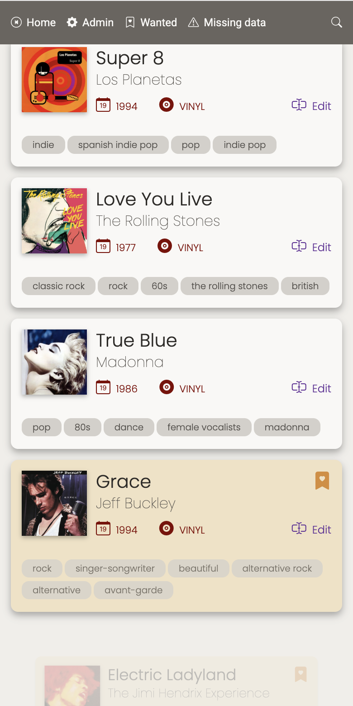
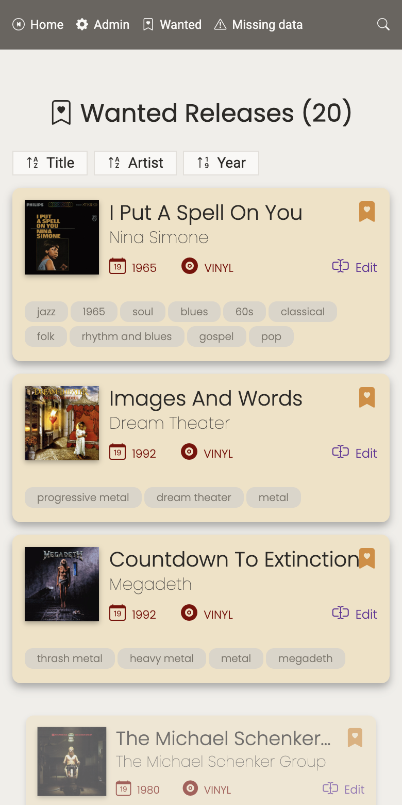
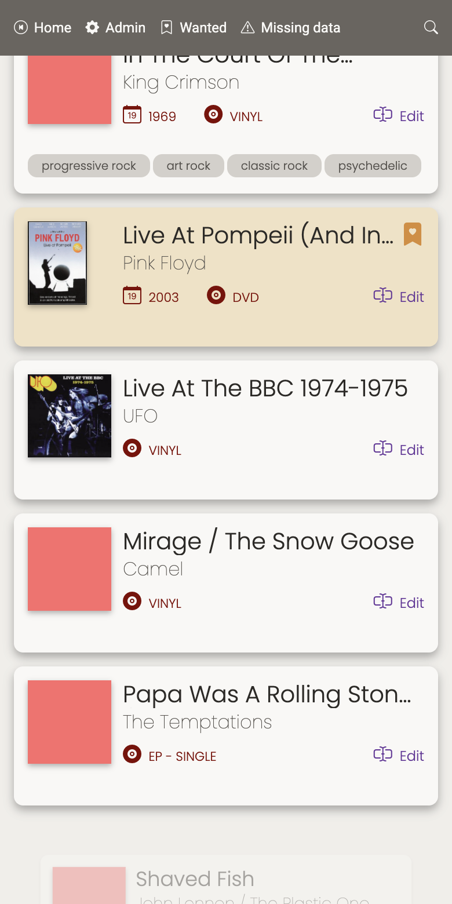
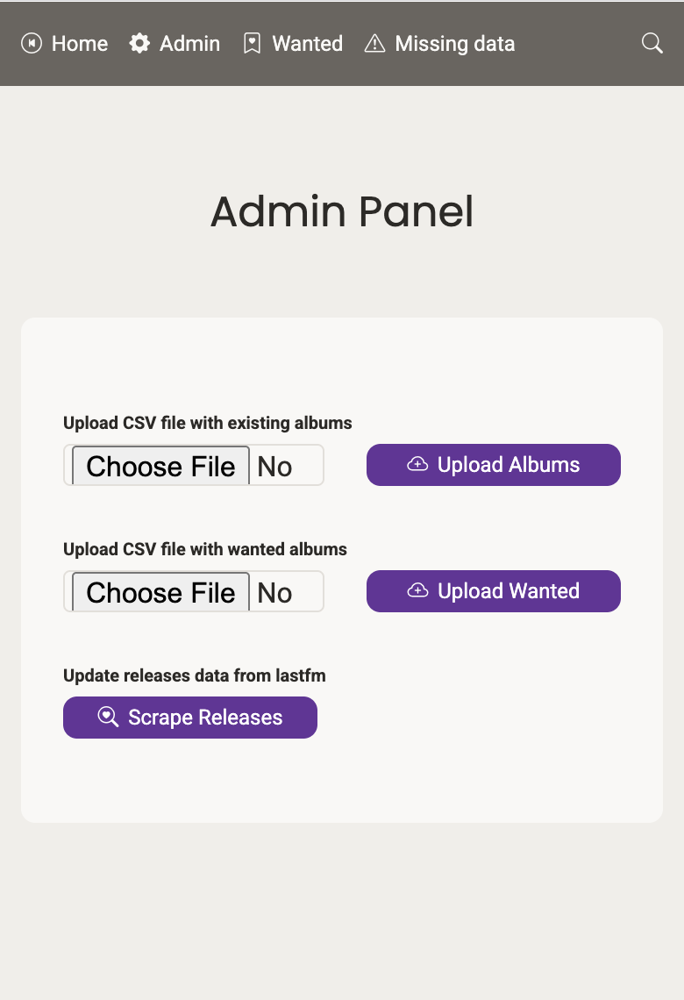
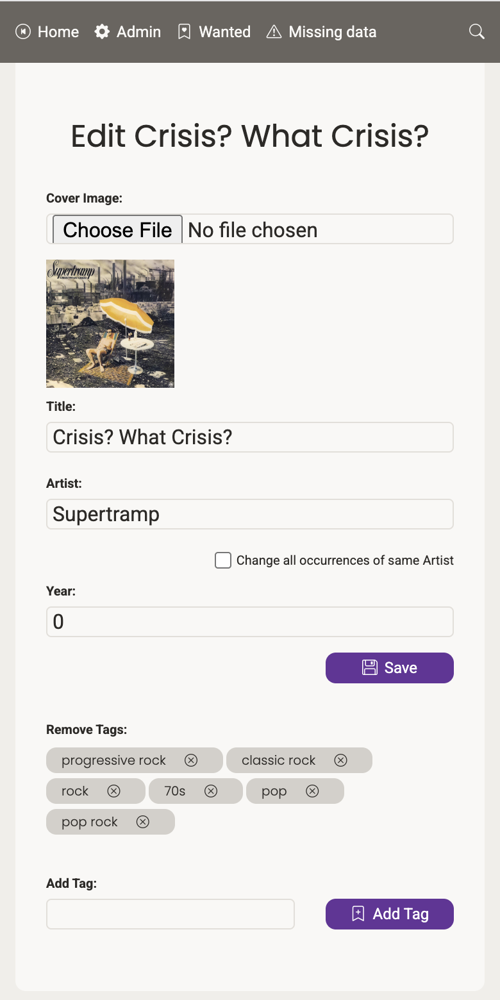
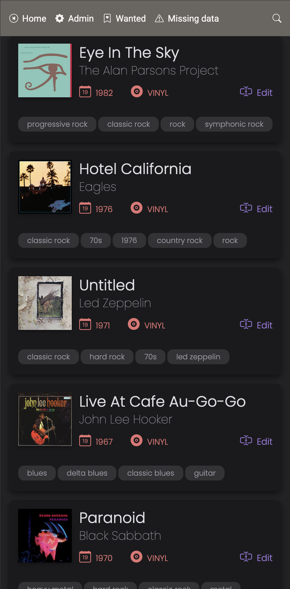

# Music Collection Manager

A web application for managing and organizing your music collection. This has been a three weekend pet project to test how much I could get done in Go using AI, without actually knowing any Go at all. I have used several models, including Gemini 2.0 Flash, Gemini 2.5 Pro, Claude 3.5 Sonnet, Deepseek v3. Take this as what it is, a pet project.

## Features
- Import music collection from a CSV file that has been exported from Discogs.
- Import wishlist from a CSV file that has been exported from Discogs.
- Stores data in a PostgreSQL database.
- Browse collection by artist, year, tag, format (vinyl, cd, ...) in a simple HTML/CSS frontend.
- Scrape additional metadata from Lastfm to complete album cover, tags, year.
- Search collection.
- Edit release details, add cover manually, add/remove tags, convert wanted to owned, etc.

## Screenshots

### Home



### Wanted list



### Need scrapping

These are albums that are missing cover, tags, year, or other metadata.


### Admin

Used to upload discogs CSV files or start the scrapping process.


### Edit album



### Dark mode



## Requirements

- Go 1.23+
- PostgreSQL
- Docker

## Setup

1. **Clone the repository**

```sh
git clone git@github.com:zigotica/music-collection-discogs.git
cd music-collection-discogs
```

2. Set up the env vars

Add these with your own values into a file called `.env`

```
DB_USER=user
DB_PASSWORD=password
DB_NAME=music_collection
DB_HOST=db
DB_PORT=5432
DB_SSLMODE=disable
```

## Docker Deployment

```sh
docker compose build
docker compose up
```
Build is only needed once, or every time you modify the code.

## Accessing the application:

- **Local Development:** Access the application at http://localhost:8080.
- **Cloud Deployment:** If deploying to a cloud environment, the application address will depend on your cloud provider's configuration (e.g., a public IP address or a domain name).  Ensure that port 8080 is open in your firewall or security group.

## Data Persistence

The database data is stored in a Docker volume located at `./postgres_data` on the host machine.  The album cover images are stored in `./web/static/covers`. These directories are mounted as volumes in the `docker-compose.yml` file to ensure that the data persists even when the container is stopped or removed.


### Example database query from container exec:

```PostgreSQL
psql -U user -d music_collection -c "SELECT release_id, artist, title, physical FROM releases ORDER BY release_id;"
```

## Potential improvements:

- [ ] Improve dark mode colors
- [ ] Code Style: enforce a consistent code style using a linter and formatter
- [ ] Scrap real time feedback
- [ ] Access control / User Roles
- [ ] Automated Testing
- [ ] CI/CD Pipeline
- [ ] Code Documentation
- [ ] Improve error handling
- [ ] Performance Optimization
- [ ] Internationalization (i18n)
- [ ] Dependency Management: keep dependencies up-to-date and address any security vulnerabilities

## License

This project is licensed under the MIT License - see the [LICENSE](LICENSE) file for details.
